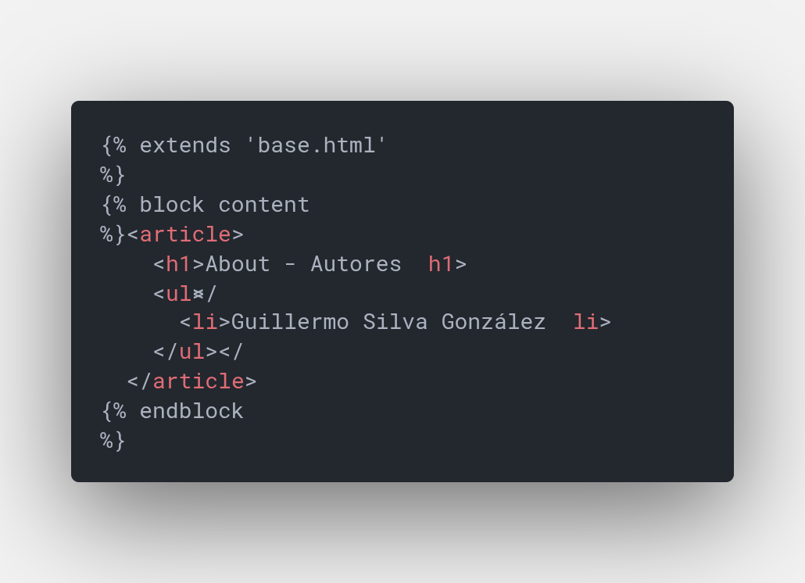
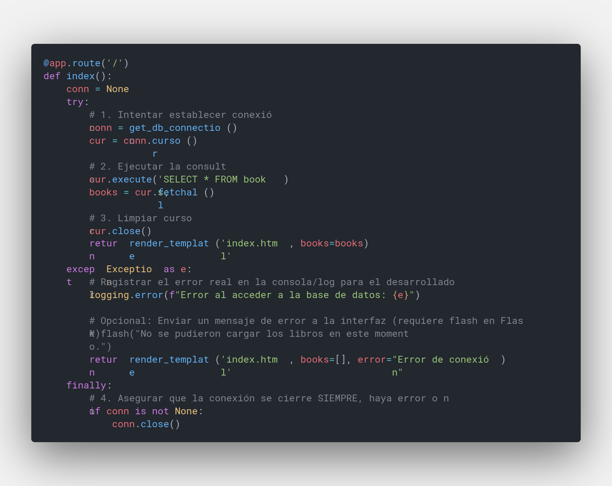
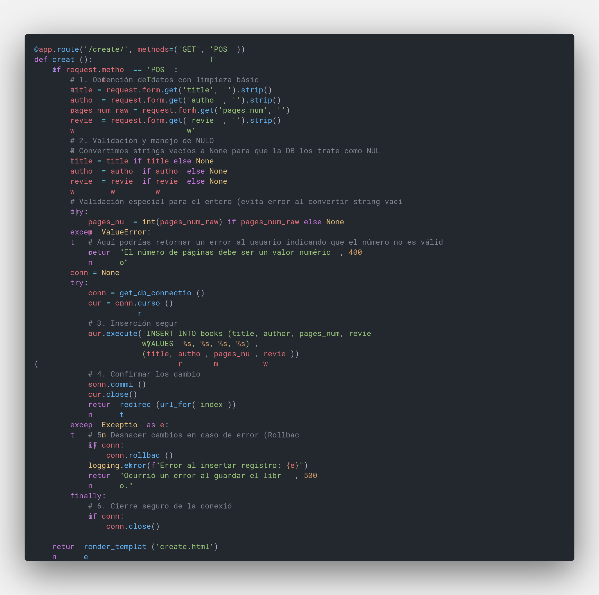
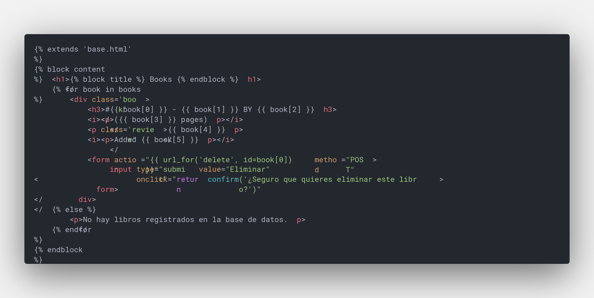
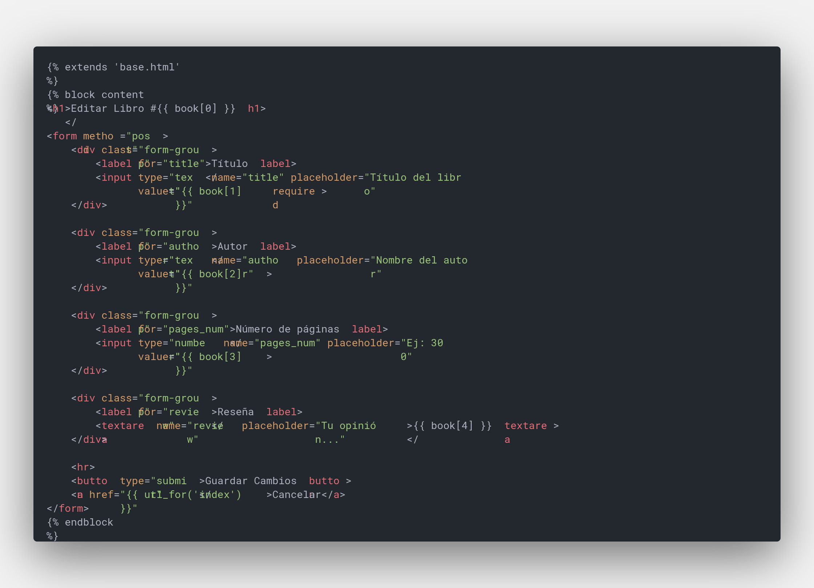
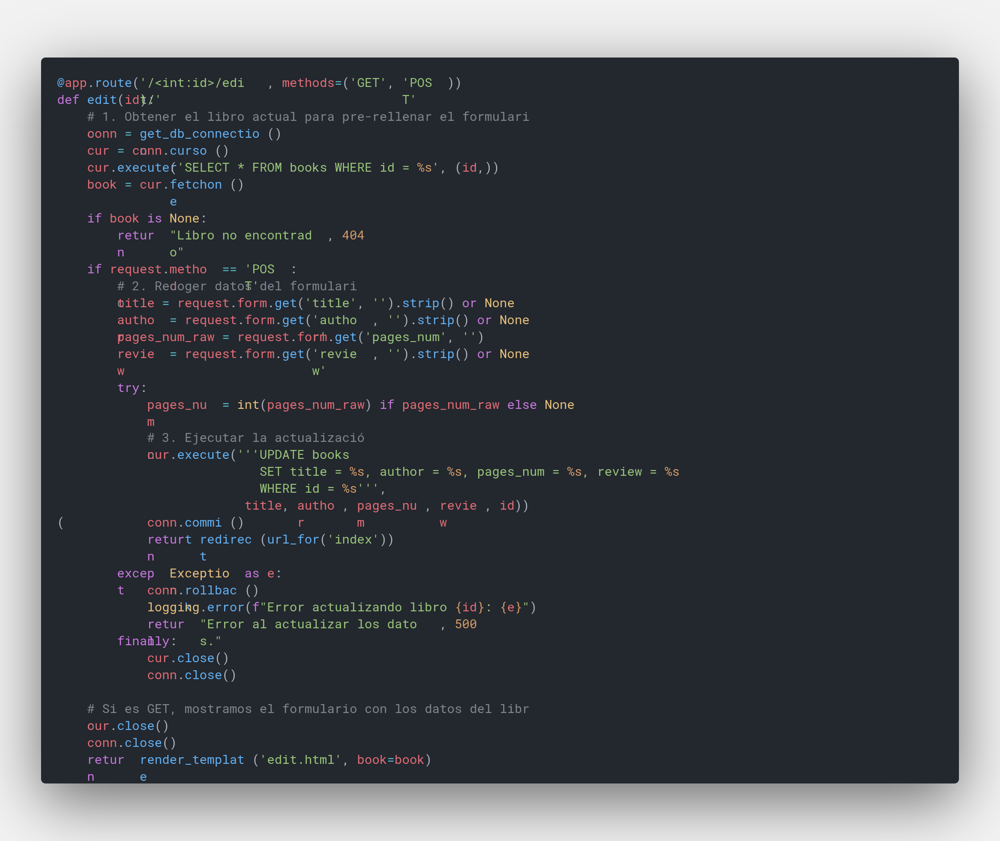

# Práctica 9 ADBD - REST API con Flask

## Instalación

> Asegurese de tener instaldo python3 en su sistema

```sh
# Creación de un entorno virtual
cd mi-practica/
python3 -m venv env
#  Instalación de conector postgresql
./env/bin/pip3 install flask psycopg2
```

## Equipo

- **Guillermo Silva González**

## Descripción del Proyecto

Aplicación web desarrollada con **Flask** y **PostgreSQL** que implementa un sistema completo de gestión de libros con operaciones CRUD (Crear, Leer, Actualizar, Eliminar). La aplicación incluye medidas de seguridad contra vulnerabilidades comunes y manejo robusto de excepciones en la base de datos.

## Requisitos Implementados

### 1. Base de Datos PostgreSQL con 9+ Registros

#### Creación e Inicialización

Se implementó el archivo `init_db.py` que:

- Crea la tabla `books` con estructura optimizada
- Inserta **10 registros** de libros clásicos
- Incluye manejo de excepciones para conexión y operaciones
- Registra el progreso mediante logging

```python
# Registros insertados:
1. A Tale of Two Cities - Charles Dickens (489 páginas)
2. Anna Karenina - Leo Tolstoy (864 páginas)
3. 1984 - George Orwell (328 páginas)
4. The Great Gatsby - F. Scott Fitzgerald (180 páginas)
5. One Hundred Years of Solitude - Gabriel García Márquez (417 páginas)
6. Pride and Prejudice - Jane Austen (279 páginas)
7. The Hobbit - J.R.R. Tolkien (310 páginas)
8. Brave New World - Aldous Huxley (268 páginas)
9. The Catcher in the Rye - J.D. Salinger (234 páginas)
10. To Kill a Mockingbird - Harper Lee (281 páginas)
```

**Captura de pantalla - Inserción de registros:**


### 2. Chequeo de Excepciones en init_db.py

La inicialización de la base de datos implementa validación completa de conexión y operaciones.

**Excepciones manejadas:**

- `psycopg2.OperationalError` - Errores de conexión
- `psycopg2.DatabaseError` - Errores en operaciones SQL
- `Exception` - Errores inesperados

**Características implementadas:**

```python
try:
    # Conexión a PostgreSQL
    conn = psycopg2.connect(...)
    cur = conn.cursor()

    # Creación de tabla
    cur.execute('CREATE TABLE books (...)')

    # Inserción con validación individual
    for book in books_data:
        try:
            cur.execute('INSERT INTO books (...) VALUES (%s, %s, %s, %s)', book)
        except psycopg2.DatabaseError as e:
            logging.error(f"Error al insertar: {e}")
            conn.rollback()

    conn.commit()

except psycopg2.OperationalError as e:
    logging.error(f"Error de conexión: {e}")

finally:
    # Cierre seguro de recursos
    if cur is not None:
        cur.close()
    if conn is not None:
        conn.close()
```

### 3. About - Información del Equipo

Se personalizó la página `about.html` con los datos del equipo.

**Contenido:**

```html
<h1>About - Autores</h1>
<ul>
  <li>Guillermo Silva González</li>
</ul>
```

**Capturas de pantalla:**



### 4. Visualización de Registros (READ)

**Ruta implementada:** `GET /`

La función `index()` en `app.py` implementa lectura de todos los registros con:

```python
@app.route('/')
def index():
    conn = None
    try:
        # 1. Establecer conexión
        conn = get_db_connection()
        cur = conn.cursor()

        # 2. Ejecutar consulta parametrizada (previene SQL Injection)
        cur.execute('SELECT * FROM books;')
        books = cur.fetchall()

        cur.close()
        return render_template('index.html', books=books)

    except Exception as e:
        # Registrar error y mostrar mensaje amigable
        logging.error(f"Error al acceder a la base de datos: {e}")
        return render_template('index.html', books=[], error="Error de conexión")

    finally:
        # Cierre seguro de la conexión
        if conn is not None:
            conn.close()
```

**Características de seguridad:**

- Validación de conexión con try-except
- Uso de parametrized queries (previene SQL Injection)
- Logging de errores para debugging
- Cierre garantizado de recursos (finally block)

**Captura de pantalla:**


### 5. Inserción de Nuevos Registros (CREATE)

**Ruta implementada:** `GET/POST /create/`

#### Características implementadas:

- Validación de entrada con `strip()`
- Manejo de campos nulos/opcionales
- Validación de tipo para `pages_num`
- Parametrized queries (SQL Injection prevention)
- Manejo completo de excepciones
- Rollback en caso de error

```python
@app.route('/create/', methods=('GET', 'POST'))
def create():
    if request.method == 'POST':
        # Validación y limpieza de datos
        title = request.form.get('title', '').strip()
        author = request.form.get('author', '').strip()
        pages_num_raw = request.form.get('pages_num', '')
        review = request.form.get('review', '').strip()

        # Manejo de campos nulos
        title = title if title else None
        author = author if author else None
        review = review if review else None

        # Validación de tipo (pages_num debe ser entero)
        try:
            pages_num = int(pages_num_raw) if pages_num_raw else None
        except ValueError:
            return "El número de páginas debe ser un valor numérico", 400

        # Inserción con manejo de excepciones
        try:
            cur.execute('INSERT INTO books (title, author, pages_num, review) '
                        'VALUES (%s, %s, %s, %s)',
                        (title, author, pages_num, review))
            conn.commit()

        except Exception as e:
            conn.rollback()
            logging.error(f"Error al insertar: {e}")
            return "Error al guardar el libro", 500

        finally:
            conn.close()

        return redirect(url_for('index'))

    return render_template('create.html')
```

**Casos de validación:**

- Campos vacíos → convertidos a NULL
- Número de páginas inválido → error 400
- Errores de BD → Rollback automático
- Conexión perdida → mensaje de error

**Captura de pantalla:**


### 6. Operación de Borrado (DELETE)

**Ruta implementada:** `POST /<id>/delete/`

#### Características de seguridad:

- Solo acepta peticiones POST (previene eliminaciones accidentales)
- ID validado automáticamente como entero
- Parametrized queries (SQL Injection prevention)
- Verificación de existencia del registro
- Manejo de excepciones

```python
@app.route('/<int:id>/delete/', methods=('POST',))
def delete(id):
    conn = None
    try:
        conn = get_db_connection()
        cur = conn.cursor()

        # Eliminación parametrizada
        cur.execute('DELETE FROM books WHERE id = %s', (id,))

        # Verificar si se eliminó algo
        if cur.rowcount == 0:
            logging.warning(f"Intento de eliminar registro inexistente: {id}")
        else:
            conn.commit()
            logging.info(f"Libro eliminado - ID: {id}")

        cur.close()

    except Exception as e:
        if conn:
            conn.rollback()
        logging.error(f"Error al eliminar ID {id}: {e}")

    finally:
        if conn:
            conn.close()

    return redirect(url_for('index'))
```

**Capturas de pantalla:**



### 7. Operación de Actualización (UPDATE)

**Ruta implementada:** `GET/POST /<id>/edit/`

#### Características implementadas:

- Verificación de existencia del registro (404 si no existe)
- Formulario prellenado con datos actuales
- Validación de campos nulos
- Validación de tipo para `pages_num`
- Parametrized queries (SQL Injection prevention)
- Manejo robusto de excepciones

```python
@app.route('/<int:id>/edit/', methods=('GET', 'POST'))
def edit(id):
    conn = get_db_connection()
    cur = conn.cursor()

    # Verificar existencia del registro
    cur.execute('SELECT * FROM books WHERE id = %s', (id,))
    book = cur.fetchone()

    if book is None:
        cur.close()
        conn.close()
        return "Libro no encontrado", 404

    if request.method == 'POST':
        # Validación de datos
        title = request.form.get('title', '').strip() or None
        author = request.form.get('author', '').strip() or None
        pages_num_raw = request.form.get('pages_num', '')
        review = request.form.get('review', '').strip() or None

        try:
            pages_num = int(pages_num_raw) if pages_num_raw else None

            # Actualización parametrizada
            cur.execute('''UPDATE books
                           SET title = %s, author = %s, pages_num = %s, review = %s
                           WHERE id = %s''',
                        (title, author, pages_num, review, id))

            conn.commit()
            cur.close()
            conn.close()
            return redirect(url_for('index'))

        except Exception as e:
            conn.rollback()
            logging.error(f"Error actualizando libro {id}: {e}")
            cur.close()
            conn.close()
            return "Error al actualizar los datos", 500

    # GET: mostrar formulario con datos actuales
    cur.close()
    conn.close()
    return render_template('edit.html', book=book)
```

**Capturas de pantalla:**



## Medidas de Seguridad Implementadas

### 1. **Prevención de SQL Injection**

Todas las consultas usan parametrized queries con placeholders `%s`:

```python
# INSEGURO - Vulnerable a SQL Injection
cur.execute(f"SELECT * FROM books WHERE id = {id}")

# SEGURO - Parametrized Query
cur.execute("SELECT * FROM books WHERE id = %s", (id,))
```

### 2. **Validación de Entrada**

- Limpieza con `strip()` para espacios en blanco
- Conversión de tipos (int para pages_num)
- Manejo de campos nulos/opcionales
- Validación de rangos

### 3. **Manejo de Excepciones Completo**

- Try-except para operaciones de BD
- Rollback automático en caso de error
- Logging de eventos para auditoría

### 4. **Cierre Garantizado de Recursos**

Bloque finally para asegurar cierre de conexiones:

```python
finally:
    if conn is not None:
        conn.close()
    if cur is not None:
        cur.close()
```

### 5. **Logging de Errores**

```python
logging.error(f"Error al acceder a BD: {e}")
logging.warning(f"Intento de acceso a recurso: {id}")
```

### 6. **Método POST para Operaciones Destructivas**

```python
@app.route('/<int:id>/delete/', methods=('POST',))
# Solo acepta POST, previene eliminaciones accidentales por GET
```

### 7. **Validación de Tipos con Flask**

```python
@app.route('/<int:id>/edit/', methods=('GET', 'POST'))
# id validado automáticamente como entero
```
